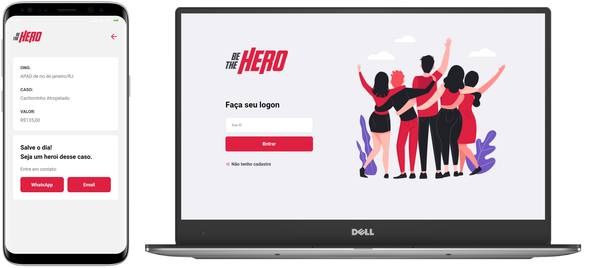

<h1 align="center">
    
</h1>

# be-the-hero
Projeto realizado durante a semana OmniStack da Rocketseat


<p align="center">
  <a href="#rocket-tecnologias">Tecnologias</a>&nbsp;&nbsp;&nbsp;|&nbsp;&nbsp;&nbsp;
  <a href="#💻-projeto">Projeto</a>&nbsp;&nbsp;&nbsp;|&nbsp;&nbsp;&nbsp;
  <a href="#🔖-layout">Layout</a>&nbsp;&nbsp;&nbsp;|&nbsp;&nbsp;&nbsp;
  <a href="#começando">Começando</a>&nbsp;&nbsp;&nbsp;|&nbsp;&nbsp;&nbsp;
  <a href="#memo-licença">Licença</a>
</p>

<p align="center">
  
</p>


## :rocket: Tecnologias

Esse projeto foi desenvolvido com as seguintes tecnologias:

- [Node.js](https://nodejs.org/en/)
- [React](https://reactjs.org)
- [React Native](https://facebook.github.io/react-native/)
- [Expo](https://expo.io/)


## 💻 Projeto

O BeTheHero é um projeto que visa conectar pessoas que desejam fazer contribuições monetárias a ONGs (Organizações não governamentais) que precisam de ajuda.


## 🔖 Layout

Você pode visualizar o layout do projeto no formato através [desse link](https://www.figma.com/file/2C2yvw7jsCOGmaNUDftX9n/Be-The-Hero---OmniStack-11?node-id=37%3A394). Lembrando que você irá precisar ter uma conta no [Figma](http://figma.com/).


## Começando

 1. Clone esse repositorio ```git clone https://github.com/olucasokarin/be-the-hero.git```
 2. Mova para a directorio: ```cd be-the-hero```
 3. Run ```npm install``` para instalar as dependencias
 
### Começar o servidor
 
 1. Mova para o directorio do backend: ```cd backend```
 2. Run ```npm start```
 
 Caso dê algum erro no banco de dados
 
 
 Run ```npx knex migrate:rollback --all``` para apagar os valores do banco de dados
 
 Run ```npx knex migrate:latest``` para iniciar o banco e criar as tabelas
 
### Começar o frontend
 
 1. Mova para o directorio do frontend: ```cd frontend```
 2. Run ```npm start```
 
### Começar o mobile
 
 O projeto mobile foi desenvolvido usando a ferramento expo que permite facil acesso às API do sistema.
 Basta instalar no computador e baixar um app na **play store** ou **apple store** 
 
 1. Mova para o directorio do mobile: ```cd mobile```
 2. Run ```npm install expo-cli --global```
 3. Run ```expo start```
 4. Baixe o app na loja
 5. Leia o QRCode
 
 Caso dê algum erro de conexão e não mostre nenhum caso
 
 Mude o ip da ```baseURL``` do arquivo ```src/services/api.js``` para o ip da sua maquina, para descobrir o ip é só rodar ```ipconfig``` no terminal windows para ver o ip.
 
 
 ## :memo: Licença

Esse projeto está sob a licença MIT. Veja o arquivo [LICENSE](LICENSE.md) para mais detalhes.
